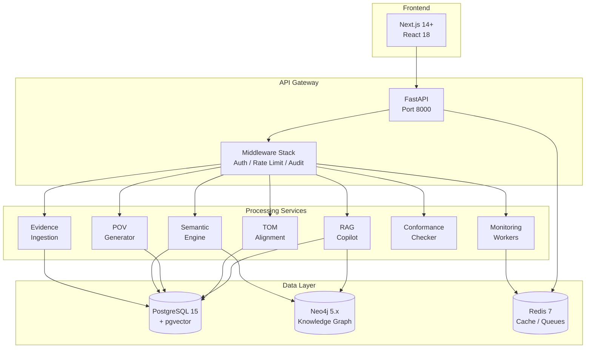
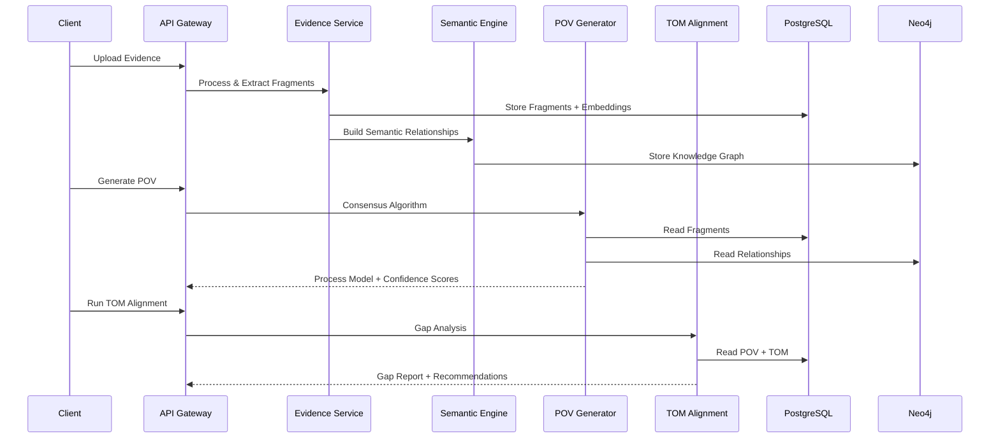
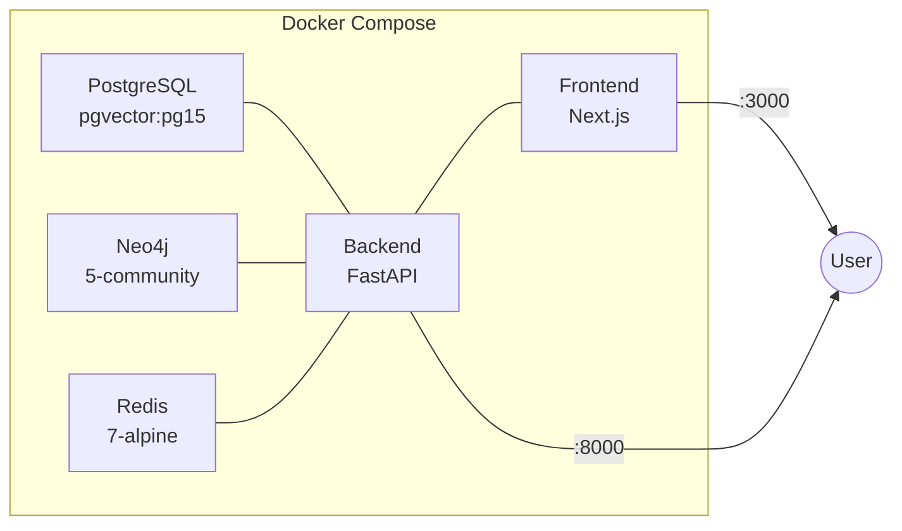

# KMFlow Architecture

## System Overview

## Data Flow

## Middleware Stack

Middleware executes in this order (outermost first):

1. **RateLimitMiddleware** - Per-IP request throttling (100/min)
2. **RequestIDMiddleware** - Unique X-Request-ID on every response
3. **AuditLoggingMiddleware** - Logs POST/PUT/PATCH/DELETE with user context
4. **SecurityHeadersMiddleware** - X-Frame-Options, CSP, etc.
5. **CORSMiddleware** - Cross-origin request handling

## Authentication & Authorization

- **JWT** (HS256) with 30-minute access tokens and 7-day refresh tokens
- **RBAC** with 5 roles: platform_admin, engagement_lead, process_analyst, evidence_reviewer, client_viewer
- **Permission-based** route protection via `require_permission()` dependency
- 17/18 route files protected (health endpoint intentionally public)

## Database Schema

- **31 models** across engagements, evidence, semantic, POV, TOM, regulatory, monitoring, patterns, simulation, conformance, and copilot domains
- **pgvector** for semantic similarity search on evidence fragment embeddings
- **Neo4j** for knowledge graph (entities, relationships, processes)
- **Redis** for rate limiting, WebSocket state, monitoring job queues

## Deployment

Production overlay (`docker-compose.prod.yml`) adds resource limits, log rotation, and security hardening.
