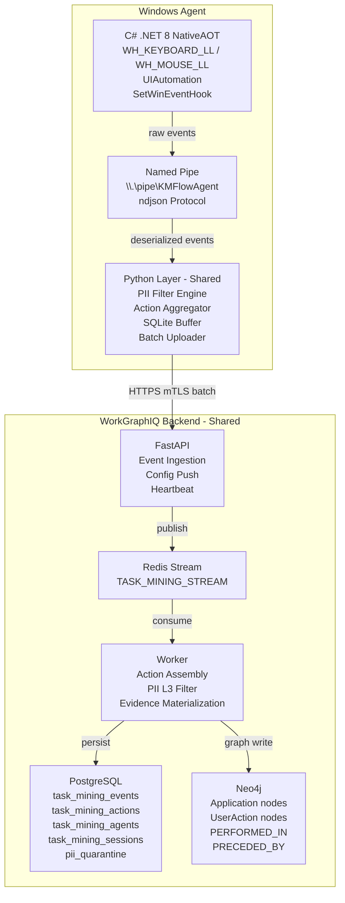
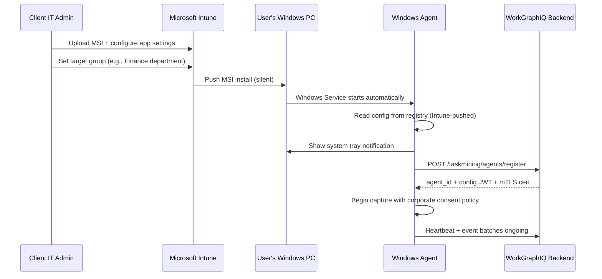

# WorkGraphIQ Task Mining Agent (Windows) - Product Requirements Document

**Version**: 1.0.0
**Status**: Draft
**Last Updated**: 2026-02-28
**Author**: Paul Roth
**Classification**: Internal - Confidential

---

## 1. Executive Summary

The WorkGraphIQ Task Mining Agent for macOS (`docs/prd/PRD_WGI_TaskMining.md`) established a first-party desktop observation capability for consulting engagements. It captures observed desktop behavior as PII-filtered evidence, achieving 0.9 source weight in the confidence scoring model. The macOS agent shipped as a Swift + Python hybrid with four-layer PII architecture and engagement/enterprise deployment modes.

**Why Windows Now**:

Enterprise consulting engagements run predominantly on Windows. According to Statcounter (Jan 2026), Windows holds 72% of enterprise desktop market share. The macOS agent covers only the minority of desks in most engagement environments. Expanding to Windows unlocks the primary desktop platform for process discovery.

**What This PRD Defines**:

A first-party native Windows desktop agent that provides feature parity with the macOS agent's current capabilities (Phase 1 + Phase 2 baseline). The Windows agent uses C# / .NET 8 with NativeAOT compilation for the capture layer, shares the existing Python intelligence layer (with platform abstraction), and communicates with the identical backend API. No backend changes are required.

**What This PRD Does NOT Define**:

- Changes to the backend API, database schema, or knowledge graph — these are shared and already implemented
- Changes to the macOS agent — it continues independently
- Phase 3+ capabilities (process assembly, variant detection, cross-agent analysis) — these are platform-independent backend features defined in the macOS PRD

**Relationship to macOS PRD**: This document is a companion to `PRD-KMF-003` (macOS Task Mining Agent PRD). Sections that are identical across platforms (Event Taxonomy, Evidence Integration, Database Schema, API Specification) reference the macOS PRD rather than duplicating content. Sections that differ (Architecture, Deployment, Security, PII Layer 1) are fully specified here.

---

## 2. Problem Statement

### 2.1 The Windows Gap

The macOS Task Mining Agent successfully addresses the evidence gap for macOS users. However, most enterprise consulting engagements involve Windows desktops:

- Financial services: 85%+ Windows desktop share
- Government and defense: 90%+ Windows desktop share
- Healthcare administration: 80%+ Windows desktop share
- Manufacturing back-office: 75%+ Windows desktop share

An engagement where task mining can only capture macOS users produces a biased sample. Process discovery requires observing the users who actually perform the target business processes, and those users are predominantly on Windows.

### 2.2 Why Not Cross-Platform Frameworks

Cross-platform desktop frameworks (Electron, Avalonia, MAUI) cannot access the low-level OS APIs required for task mining:

| Requirement | Why Cross-Platform Fails |
|-------------|------------------------|
| Global input hooks | `WH_KEYBOARD_LL` / `WH_MOUSE_LL` require native Windows hook DLLs; no cross-platform abstraction exists |
| UI Automation | `System.Windows.Automation` is Windows-only; macOS uses `AXUIElement` — fundamentally different APIs |
| Credential storage | DPAPI is Windows-only; macOS Keychain is macOS-only — no common abstraction |
| System tray | WPF `NotifyIcon` vs. macOS `NSStatusItem` — different interaction models |
| Code signing | Authenticode vs. Apple Developer ID — entirely different toolchains |

The correct architecture is a thin native capture layer per platform (Swift on macOS, C# on Windows) with a shared Python intelligence layer. This is the architecture the macOS agent already uses.

### 2.3 Privacy Requirements Are Identical

The four-layer PII architecture is not optional on Windows. The same regulatory and ethical requirements apply:

- GDPR applies to EU users regardless of OS
- Client data processing agreements are OS-agnostic
- PII in password fields, clipboard content, and window titles exists on all platforms
- Enterprise deployment requires the same consent and transparency guarantees

---

## 3. Product Vision

The Windows Task Mining Agent extends WorkGraphIQ's desktop observation capability to the dominant enterprise platform. It provides the same privacy-first, evidence-grade process discovery that the macOS agent delivers, using native Windows APIs for capture and the shared Python + backend pipeline for intelligence and evidence materialization.

**Vision Statement**: A lightweight, privacy-first Windows desktop agent that observes actual work patterns using native Windows APIs, applies mandatory four-layer PII filtering before any data leaves the device, and feeds observed behavior into the shared WorkGraphIQ evidence pipeline with 0.9 source weight.

**Guiding Principles** (identical to macOS):
- Privacy-first: four-layer PII filtering is architectural, not configurable off
- Lightweight: agent CPU < 3%, memory < 150MB, invisible to users during normal work
- Evidence-grade: captured data meets the same quality standards as all other WorkGraphIQ evidence
- Consulting-native: supports both bounded engagement deployment and enterprise MDM deployment
- Transparent consent: users know the agent is running, what it captures, and how to opt out of content-level capture

**Windows-Specific Principle**:
- Enterprise-compatible: works within Windows security boundaries (SmartScreen, WDAC, UAC, Credential Guard) without requiring security exceptions

---

## 4. Market Context

### 4.1 Windows in Enterprise Desktop

| Metric | Value |
|--------|-------|
| Windows enterprise desktop market share (2026) | ~72% |
| Windows 10 LTSC still in enterprise use | ~25% of Windows fleet |
| Windows 11 enterprise adoption | ~65% of Windows fleet |
| Minimum supportable version | Windows 10 1903 (build 18362) |

### 4.2 Competitive Landscape (Windows-Specific)

| Vendor | Windows Agent | Strength | Gap vs. WorkGraphIQ |
|--------|--------------|----------|----------------|
| **Celonis Task Mining** | Native Windows sensor | Mature Windows support, EMS integration | No knowledge graph; no consulting workflow; vendor PII |
| **UiPath Task Mining** | Windows desktop recorder | Deep RPA integration, large install base | RPA-centric; no evidence triangulation |
| **Soroco Scout** | Windows agent | Enterprise deployment tooling | Black-box PII; $25K/engagement; no Consensus scoring |
| **Microsoft Viva Insights** | M365 behavioral data | Zero-deploy for M365 shops | M365 only; no desktop-wide capture |

### 4.3 WorkGraphIQ's Windows Positioning

WorkGraphIQ enters the Windows task mining market with advantages no competitor has:

1. **Cross-platform evidence fusion**: macOS + Windows task mining data feeds the same knowledge graph, enabling cross-platform process discovery in mixed-OS environments
2. **Identical backend**: No "Windows version" of the backend — same API, same schema, same confidence model
3. **Consulting deployment model**: Engagement mode with auto-disable, not just always-on enterprise licenses
4. **Four-layer PII architecture**: Mandatory, not configurable — same guarantee as macOS

---

## 5. Architecture

### 5.1 System Overview

The Windows agent mirrors the macOS agent's hybrid architecture: a native capture layer (C# instead of Swift) communicates with the shared Python intelligence layer via local IPC (named pipes instead of Unix domain sockets). The Python layer and backend are identical across platforms.



### 5.2 C# Capture Layer

The C# layer handles all Windows-specific event capture. It compiles to a single native executable via .NET 8 NativeAOT, eliminating the .NET runtime dependency on client machines.

**Why C# / .NET 8 with NativeAOT**:

| Decision Factor | C# / .NET 8 | C++ / Win32 | Rust |
|----------------|:-----------:|:-----------:|:----:|
| UI Automation access | Native (`System.Windows.Automation`) | COM interop (verbose) | FFI to COM (painful) |
| Async/await | First-class | Manual (IOCP) | First-class |
| Named pipes | `System.IO.Pipes` | `CreateNamedPipe` | `windows` crate |
| DPAPI | `ProtectedData.Protect()` | `CryptProtectData` | FFI |
| NativeAOT (no runtime) | Yes (.NET 8+) | N/A (always native) | N/A (always native) |
| Developer availability | High | Medium | Low |
| Swift architectural parity | High (async/await, interfaces, value types) | Low | Medium |

**Hook DLL (C)**: A small C DLL is required for `WH_KEYBOARD_LL` and `WH_MOUSE_LL` hooks. These hooks execute in a system-wide callback that must not block. A managed (.NET) hook callback introduces GC pause risk, which can cause the OS to silently unhook the callback after a timeout (Windows enforces a ~200ms hook callback deadline). The C DLL captures raw hook events into a lock-free ring buffer; the C# process polls this buffer.

| Windows API | Purpose | Events Produced |
|-------------|---------|----------------|
| `WH_KEYBOARD_LL` + `WH_MOUSE_LL` (via hook DLL) | Keyboard and mouse events at the system level | `KEYBOARD_ACTION`, `KEYBOARD_SHORTCUT`, `MOUSE_CLICK`, `MOUSE_DOUBLE_CLICK`, `MOUSE_DRAG`, `COPY_PASTE`, `SCROLL` |
| `UIAutomation` (`AutomationElement`) | Accessibility API for UI element inspection | `UI_ELEMENT_INTERACTION`, `WINDOW_FOCUS` |
| `SetWinEventHook(EVENT_SYSTEM_FOREGROUND)` | Application lifecycle and foreground changes | `APP_SWITCH`, `FILE_OPEN`, `FILE_SAVE` |
| `Windows.Graphics.Capture` (Phase 2) | Screen capture with window-level granularity | `SCREEN_CAPTURE` |
| `UIAutomation` + browser extensions | Browser URL monitoring | `URL_NAVIGATION`, `TAB_SWITCH` |
| `GetLastInputInfo()` | Idle detection | `IDLE_START`, `IDLE_END` |

**L1 PII filtering (C# layer)**: The C# layer enforces capture prevention before events are generated, mirroring the Swift layer's behavior:

| macOS (Swift) | Windows (C#) | Behavior |
|--------------|-------------|----------|
| `AXUIElement` role = `AXSecureTextField` | `AutomationElement.IsPasswordProperty == true` | No event generated for password fields |
| `NSWorkspace` bundle ID vs. allowlist | `Process.MainModule.FileName` vs. allowlist | No events for blocked apps |
| Browser window title heuristics | Browser window title heuristics (same patterns) | No URL events in private/incognito windows |
| `NSWorkspace` screen lock notification | `WTSRegisterSessionNotification` + `SystemEvents.SessionSwitch` | Capture suspended on lock |
| Bundle ID blocklist (hardcoded) | Process path blocklist (hardcoded) | No events for password managers, etc. |

### 5.3 Python Layer (Shared, with Platform Abstraction)

The Python layer is the same codebase used by the macOS agent, with a new platform abstraction layer that isolates OS-specific behavior.

**New abstraction: `agent/python/kmflow_agent/platform/`**

| Component | macOS Implementation | Windows Implementation |
|-----------|---------------------|----------------------|
| IPC transport | `asyncio.start_unix_server` (Unix socket) | `asyncio` named pipe server (or TCP loopback fallback) |
| Data directory | `~/Library/Application Support/KMFlowAgent/` | `%LOCALAPPDATA%\KMFlowAgent\` |
| Credential storage | macOS Keychain (`security` CLI) | DPAPI (`ProtectedData`) via `ctypes` or Windows Credential Manager (`cmdkey`) |
| File permissions | `chmod 0600` | NTFS ACL (owner-only via `icacls`) |
| Process identity | Bundle ID (`com.microsoft.Excel`) | Executable path → app name mapping table |

The platform abstraction is a runtime selection:

```python
# agent/python/kmflow_agent/platform/__init__.py
import sys

if sys.platform == "darwin":
    from kmflow_agent.platform._macos import MacOSPlatform as Platform
elif sys.platform == "win32":
    from kmflow_agent.platform._windows import WindowsPlatform as Platform
else:
    raise RuntimeError(f"Unsupported platform: {sys.platform}")
```

### 5.4 Backend Data Flow

Identical to macOS PRD Section 5.4. The backend is platform-agnostic. The `os_version` field in `task_mining_agents` distinguishes Windows agents from macOS agents. All other processing is identical.

### 5.5 Packaging

**Windows Engagement Mode**: MSIX package distributed as a `.msix` file for manual install. MSIX provides:
- Automatic cleanup on uninstall (no registry residue)
- AppContainer isolation (optional)
- Sideloading support for enterprise environments
- Built-in code signing (Authenticode)

**Windows Enterprise Mode**: MSI package built with WiX Toolset for deployment via:
- Microsoft Intune (modern MDM)
- SCCM / Microsoft Endpoint Configuration Manager (traditional)
- Group Policy Software Installation (GPO)

The MSI includes:
- NativeAOT-compiled C# executable (single file, no .NET runtime dependency)
- Hook DLL (`KMFlowAgent.HookDll.dll`)
- Embedded Python runtime with all dependencies
- PII regex pattern library
- Task Scheduler XML for engagement-mode auto-start
- Windows Service registration for enterprise-mode persistence

**Configuration**: Same as macOS — engagement-specific configuration delivered via signed JWT from the backend at registration time.

### 5.6 Communication Protocol

Identical to macOS PRD Section 5.6. The ndjson protocol over IPC is the same format. The only difference is the transport:

| macOS | Windows |
|-------|---------|
| Unix domain socket at `~/Library/Application Support/KMFlowAgent/agent.sock` | Named pipe at `\\.\pipe\KMFlowAgent` |
| Socket permissions: `chmod 0600` | Pipe DACL: owner SID only |

The named pipe is created with a security descriptor that restricts access to the current user's SID. This is the Windows equivalent of `chmod 0600` on Unix domain sockets.

### 5.7 Application Identity Strategy

macOS identifies applications by bundle identifier (e.g., `com.microsoft.Excel`). Windows does not have an equivalent first-class concept. The Windows agent uses a layered identification strategy:

| Method | Scope | Example |
|--------|-------|---------|
| Process executable name | All Win32 apps | `EXCEL.EXE` → `Microsoft Excel` |
| `AppUserModelId` | UWP / MSIX / pinned apps | `Microsoft.Office.Excel_8wekyb3d8bbwe!excel` |
| Window class name | Legacy Win32 apps | `XLMAIN` → `Microsoft Excel` |
| Configurable mapping table | Engagement-specific overrides | Admin maps `CUSTOM_ERP.EXE` → `Acme ERP` |

The `app_bundle_id` field in the event protocol is populated with the best available identifier. A mapping table shipped with the agent resolves common executables to human-readable names and canonical identifiers that align with the macOS bundle ID format where possible (e.g., both platforms report `com.microsoft.Excel` for Excel).

---

## 6. Deployment Modes

### 6.1 Engagement Mode (Temporary)

| Characteristic | Value |
|---------------|-------|
| Deployment method | MSIX sideload; IT-distributed or self-service download |
| Configuration | Backend-provided JWT with engagement ID and end date |
| Auto-disable | Agent ceases capture at engagement end date; requires re-authorization to resume |
| Persistence | Task Scheduler task (runs at user logon, stops at engagement end) |
| Data scope | Bounded to engagement session window |
| Uninstall | Windows Settings > Apps > WorkGraphIQ Agent; or PowerShell `Remove-AppxPackage` |
| Consent flow | System tray notification at first launch with capture summary; user acceptance required before capture begins |

### 6.2 Enterprise Mode (Persistent)

| Characteristic | Value |
|---------------|-------|
| Deployment method | MSI push via Intune, SCCM, or GPO |
| Configuration | Intune App Configuration or GPO Registry settings with backend URL and engagement parameters |
| Persistence | Windows Service (`KMFlowAgentSvc`) running as `LOCAL SERVICE` (minimum privilege) |
| Session management | Sessions aligned to user logon/logoff or business hours (configurable) |
| Data scope | Ongoing; retention policy enforced server-side |
| Consent flow | Enterprise IT deploys with corporate data processing notice; individual opt-out for content-level capture |

### 6.3 Mode Switching

Same as macOS: an agent registered in engagement mode cannot switch to enterprise mode without re-registration. This is enforced server-side.

### 6.4 MSIX Sideloading Requirements

MSIX sideloading requires one of:
- Windows 10 1903+ with sideloading enabled (Settings > For Developers)
- Windows 11 (sideloading enabled by default)
- Intune-managed devices (sideloading policy pushed by MDM)

For locked-down environments where sideloading is disabled and cannot be enabled, the MSI installer provides an alternative that does not require sideloading.

---

## 7. PII Filtering Architecture

The four-layer PII architecture is identical in structure to the macOS agent. Layers 2, 3, and 4 are shared code (Python + backend). Only Layer 1 differs because it runs in the platform-native capture layer.

### 7.1 Architecture Overview

Same as macOS PRD Section 7.1. The four layers are:
1. L1: Capture Prevention (C# / on-device)
2. L2: At-Source Filtering (Python / on-device)
3. L3: Server-Side Processing (FastAPI + Worker)
4. L4: Data Management (Retention + Erasure)

### 7.2 Layer 1: Capture Prevention (C#, On-Device)

Events that match L1 criteria are never generated. They do not enter the event stream.

| Rule | macOS Detection | Windows Detection | Action |
|------|----------------|-------------------|--------|
| Password field | `AXSecureTextField` | `AutomationElement.IsPasswordProperty` | No event generated |
| Blocked application | `NSRunningApplication.bundleIdentifier` | `Process.MainModule.FileName` | No events for this app |
| Private browsing | Browser window title heuristics | Browser window title heuristics (same patterns + Edge InPrivate) | No URL events; keyboard metadata only |
| Screen lock | `NSWorkspace` notification | `WTSRegisterSessionNotification` (`WTS_SESSION_LOCK`) | Capture suspended |
| Sensitive system apps | Bundle ID blocklist (Keychain, Disk Utility) | Process path blocklist (Credential Manager, Windows Security) | No events generated |

**Windows-specific L1 additions**:

| Rule | Detection Method | Action |
|------|-----------------|--------|
| UAC elevation dialog | `EVENT_SYSTEM_DESKTOPSWITCH` (secure desktop transition) | Capture suspended during elevation |
| Windows Security (Defender UI) | Process name `SecurityHealthHost.exe` | No events generated |
| Credential Manager | Process name `CredentialUIBroker.exe` | No events generated |
| Remote Desktop client | Window class `TscShellContainerClass` | Configurable: block by default, allow per engagement |

**Windows password manager blocklist (hardcoded)**:

```
1Password.exe
op.exe (1Password CLI)
LastPass.exe
Bitwarden.exe
Dashlane.exe
KeePass.exe
KeePassXC.exe
RoboForm.exe
```

### 7.3 Layer 2: At-Source Filtering (Python, On-Device)

Identical to macOS PRD Section 7.3. Same regex patterns, same scrubbing logic. The L2 filter is platform-independent Python code.

### 7.4 Layer 3: Server-Side Processing

Identical to macOS PRD Section 7.4. Same NLP + LLM scan, same quarantine table.

### 7.5 Layer 4: Data Management

Identical to macOS PRD Section 7.5. Same retention policies, same GDPR erasure procedures.

---

## 8. Keystroke Capture Policy

Identical to macOS PRD Section 8. The two modes (action-level default, content-level opt-in) apply identically on Windows. The only difference is the keyboard hook implementation:

- macOS: `CGEventTap` via Swift
- Windows: `WH_KEYBOARD_LL` via C hook DLL → C# ring buffer consumer

The event payload format is identical. The `content_level` flag in `action_metadata` works the same way.

---

## 9. Event Taxonomy

Identical to macOS PRD Section 9. All 16 event types apply to Windows. The event envelope format and payload fields are the same. The `app_bundle_id` field uses the application identity strategy described in Section 5.7.

---

## 10. Evidence Integration

Identical to macOS PRD Section 10. Task mining evidence materialization, confidence scoring, Redis Streams integration, and knowledge graph integration are backend-side and platform-independent.

---

## 11. Database Schema

Identical to macOS PRD Section 11. No schema changes are required. The existing tables (`task_mining_agents`, `task_mining_sessions`, `task_mining_events`, `task_mining_actions`, `pii_quarantine`) accommodate Windows agents without modification:

- `task_mining_agents.os_version` stores `"Windows 11 23H2"` instead of `"macOS 15.3"`
- `task_mining_agents.machine_id` stores a hashed Windows machine GUID (`HKLM\SOFTWARE\Microsoft\Cryptography\MachineGuid`) instead of a hashed macOS hardware UUID
- All other columns are platform-independent

---

## 12. API Specification

Identical to macOS PRD Section 12. No API changes required. The registration endpoint accepts Windows agents with:

```json
{
  "engagement_id": "uuid",
  "hostname": "DESKTOP-ABC123",
  "machine_id_hash": "sha256-of-windows-machine-guid",
  "os_version": "Windows 11 23H2 (build 22631)",
  "agent_version": "1.0.0",
  "deployment_mode": "engagement"
}
```

The `app_allowlist` in the configuration response uses the canonical identifier format (see Section 5.7 Application Identity Strategy). An engagement can include both macOS bundle IDs and Windows executable names in the same allowlist; each agent filters for its platform.

---

## 13. User Flows

### Flow 1: Agent Deployment (Engagement Mode — Windows)

```mermaid
sequenceDiagram
    participant EL as Engagement Lead
    participant Admin as WorkGraphIQ Admin
    participant IT as Client IT
    participant User as Client User
    participant Agent as Windows Agent

    EL->>Admin: Configure engagement for task mining
    Admin->>Admin: Define app allowlist, keystroke mode, end date
    Admin->>IT: Generate MSIX installer with engagement config
    IT->>IT: Enable MSIX sideloading (if needed)
    IT->>User: Distribute MSIX via Intune/email/share
    User->>Agent: Install MSIX (or IT pushes MSI silently)
    Agent->>User: Show system tray notification + consent dialog
    User->>Agent: Accept consent
    Agent->>Admin: POST /taskmining/agents/register
    Admin-->>Agent: agent_id + config JWT + mTLS cert
    Agent->>Agent: Store cert via DPAPI; begin capture (L1 active)
    Agent->>Admin: POST /taskmining/heartbeat (every 30s)
    Agent->>Admin: POST /taskmining/events (every 30s batch)
```

### Flow 2: Enterprise Deployment via Intune



### Flow 3: PII Event Handling

Identical to macOS PRD Flow 2 (Section 13). The four-layer pipeline is the same; only L1 uses Windows APIs instead of macOS APIs.

---

## 14. Agent Performance Requirements

| Metric | Target | Measurement Method |
|--------|--------|--------------------|
| Event capture latency | < 5ms per event (p95) | Timestamp delta from Windows hook callback to C# handler completion |
| Event loss rate | < 0.1% | Sequence number gap analysis on received batches |
| Agent CPU usage | < 3% average; < 10% burst (< 30s) | Windows Task Manager / Performance Monitor sampling during load test |
| Agent memory (working set) | < 150MB | Windows Task Manager / `Process.WorkingSet64` during 8-hour session |
| Hook DLL callback latency | < 1ms (p99) | Must complete within OS-enforced ~200ms deadline; target 1ms |
| Batch upload success rate | > 99.5% within 60s of batch ready | Server-side batch receipt acknowledgment |
| PII detection recall (L2) | > 99% on benchmark PII test set | Labeled test corpus with known PII patterns |
| PII detection precision (L2) | > 95% (minimize false positive redactions) | Labeled test corpus |
| Agent startup time | < 3s from service start to first event capture | End-to-end timing in test harness |
| SQLite buffer capacity | > 100,000 events offline before loss | Offline simulation with buffer fill rate |
| Backend event ingestion throughput | > 10,000 events/second per node | Load test with simulated agent fleet |
| NativeAOT binary size | < 30MB (capture layer only) | Build output measurement |

---

## 15. Security and Privacy

### 15.1 Transport Security

Identical to macOS PRD Section 15.1. mTLS with backend-issued client certificates. On Windows, the client certificate and private key are stored using DPAPI-encrypted files in `%LOCALAPPDATA%\KMFlowAgent\`, accessible only to the installing user's SID. Port 443 only; no inbound ports.

### 15.2 Code Signing (Authenticode + SmartScreen)

The Windows executable and MSI/MSIX packages are signed with an Extended Validation (EV) code signing certificate via Authenticode:

| Concern | macOS Solution | Windows Solution |
|---------|---------------|-----------------|
| Code signing | Apple Developer ID | Authenticode (EV certificate) |
| OS trust gate | Gatekeeper | SmartScreen |
| First-run trust | Notarization | EV certificate → immediate SmartScreen reputation |
| Enterprise whitelisting | Jamf Pro allowlist | WDAC (Windows Defender Application Control) policy based on signing certificate |
| Tamper detection | Code signature verification + notarization ticket | Authenticode signature verification + catalog signing |

**EV Certificate**: An EV (Extended Validation) code signing certificate is required, not a standard OV certificate. EV certificates provide immediate SmartScreen reputation — users do not see "Windows protected your PC" warnings on first install. OV certificates require reputation accumulation over time.

**CI/CD Integration**: The build pipeline signs all binaries with the EV certificate using `signtool.exe`. The private key is stored in an Azure Key Vault HSM and accessed via the Azure SignTool during CI/CD builds.

### 15.3 Windows Defender Application Control (WDAC)

Enterprise environments using WDAC policies can whitelist the WorkGraphIQ agent by signing certificate. The MSI includes a WDAC supplemental policy file that enterprise IT can merge with their base policy:

```xml
<SignerRule>
    <CertificateSignatureLevel>PcaCertificate</CertificateSignatureLevel>
    <CertificatePublisher>CN=KMFlow Ltd, O=KMFlow Ltd</CertificatePublisher>
</SignerRule>
```

### 15.4 UAC and Privilege Model

The WorkGraphIQ agent runs as a standard user process. It does not require administrator privileges for capture operations:

| Operation | Privilege Required | How Achieved |
|-----------|-------------------|-------------|
| `WH_KEYBOARD_LL` / `WH_MOUSE_LL` hooks | Standard user | Low-level hooks do not require elevation |
| UI Automation access | Standard user | `AutomationElement` works at standard user level |
| Named pipe creation | Standard user | User-space pipe with user SID DACL |
| DPAPI encryption | Standard user | `ProtectedData.Protect()` uses user's DPAPI master key |
| MSI installation | Administrator (one-time) | MSI installer runs elevated; agent binary runs as standard user |
| Service registration | Administrator (one-time) | Service installed by MSI; runs as `LOCAL SERVICE` |
| Task Scheduler task | Standard user | Engagement mode: user-level scheduled task (no elevation) |

### 15.5 Credential Guard Compatibility

DPAPI is compatible with Credential Guard. When Credential Guard is enabled on enterprise machines, DPAPI-protected secrets remain accessible because DPAPI uses the user's password-derived master key, which is separate from the domain credential cache protected by Credential Guard. No special handling is required.

### 15.6 AV/EDR Compatibility

Global input hooks (`WH_KEYBOARD_LL`) are a known trigger for antivirus false positives. Mitigation strategy:

| Action | When | Purpose |
|--------|------|---------|
| EV code signing | Build time | Provides Authenticode trust; reduces heuristic detection |
| Pre-submission to Microsoft Defender | Pre-release | Submit signed binaries to Microsoft for analysis; request false positive exclusion |
| Pre-submission to CrowdStrike | Pre-release | Submit to Falcon Intelligence for whitelisting |
| Pre-submission to SentinelOne | Pre-release | Submit to SentinelOne threat intelligence |
| Deployment guide: AV exclusion | Engagement deployment | Document AV exclusion paths for client IT (`%LOCALAPPDATA%\KMFlowAgent\`) |
| Deployment guide: EDR exclusion | Enterprise deployment | Document EDR process exclusion for `KMFlowAgent.exe` and `KMFlowAgent.HookDll.dll` |

### 15.7 Consent and Transparency

Identical in principle to macOS PRD Section 15.3, adapted for Windows UI:

- Agent displays a system tray icon (WPF `NotifyIcon`) while running; cannot be hidden
- Consent dialog presented at first launch summarizes capture scope (WPF window)
- Content-level keystroke capture requires a separate explicit consent step
- Users can pause capture from the system tray context menu at any time
- Agent cannot be re-enabled by the user alone after a user-initiated pause

### 15.8 Data Minimization

Identical to macOS PRD Section 15.4. The agent captures only what is necessary for process discovery.

### 15.9 Audit Trail

Identical to macOS PRD Section 15.5. All registration, configuration, consent, pause/resume, PII quarantine, and GDPR erasure events generate immutable audit log entries. On Windows, local audit events are also written to the Windows Event Log (`Application` log, source `KMFlowAgent`).

---

## 16. Phased Delivery

### Phase 1 - Windows MVP (Target: Q3 2026)

**Goal**: Feature parity with macOS agent's Phase 1 + Phase 2 baseline. The Windows agent ships at the maturity level the macOS agent has already reached, benefiting from lessons learned.

| Capability | Description |
|-----------|-------------|
| C# event capture (NativeAOT) | `APP_SWITCH`, `WINDOW_FOCUS`, `MOUSE_CLICK`, `KEYBOARD_ACTION` (action-level), `KEYBOARD_SHORTCUT`, `IDLE_START`, `IDLE_END` via hook DLL + `SetWinEventHook` + `GetLastInputInfo` |
| C hook DLL | `WH_KEYBOARD_LL` + `WH_MOUSE_LL` with lock-free ring buffer; < 1ms callback latency |
| UI Automation | Password field detection (`IsPasswordProperty`), element role/description capture |
| L1 PII prevention | Password field detection, app allowlist enforcement, private browsing detection, screen lock detection, UAC elevation detection |
| L2 PII filtering | Shared Python regex scrubbing (SSN, CC, email, phone) |
| Full event taxonomy | All 16 event types including `COPY_PASTE`, `SCROLL`, `TAB_SWITCH`, `FILE_OPEN`, `FILE_SAVE`, `URL_NAVIGATION`, `UI_ELEMENT_INTERACTION` |
| Named pipe IPC | `\\.\pipe\KMFlowAgent` with DACL security; ndjson protocol |
| Python platform abstraction | `agent/python/kmflow_agent/platform/` with `_windows.py` implementation |
| Local SQLite buffer | Shared Python buffer with DPAPI-encrypted payloads; Windows path (`%LOCALAPPDATA%`) |
| Credential storage | DPAPI + Windows Credential Manager (replaces macOS Keychain) |
| Batch upload | HTTPS/mTLS to shared backend API (identical to macOS) |
| System tray app (WPF) | Tray icon, consent dialog, pause/resume, transparency log |
| Onboarding wizard | Multi-step WPF window: welcome, consent, connection test, summary |
| MSIX installer | Engagement mode: sideloadable MSIX with Authenticode signature |
| MSI installer (WiX) | Enterprise mode: MSI for Intune/SCCM/GPO deployment |
| Task Scheduler | Engagement mode: user-level auto-start at logon |
| Windows Service | Enterprise mode: `KMFlowAgentSvc` running as `LOCAL SERVICE` |
| MDM support | Intune App Configuration, GPO ADMX templates, SCCM detection rules |
| Windows Event Log | Local audit events written to Application log |
| Idle detection | `GetLastInputInfo()` with configurable threshold (default: 5 minutes) |
| Evidence materialization | Shared backend: `EvidenceItem(category=KM4WORK)` per session |
| Admin dashboard | Shared backend: Windows agents appear alongside macOS agents |

**Phase 1 Success Gate**: At least one full engagement capture cycle on Windows 10 and Windows 11 (agent install through evidence materialization and POV re-run) completed with zero PII leakage observed, < 0.1% event loss, and no AV false positive blocking on clean Windows installs.

### Phase 2 - Content and Screen Capture (Q4 2026)

| Capability | Description |
|-----------|-------------|
| Content-level keystroke | Opt-in mode with L1+L2 mandatory enforcement (same as macOS Phase 2) |
| Screenshot capture | `Windows.Graphics.Capture` API with local OCR + bounding-box PII redaction |
| L3 PII processing | Shared backend: spaCy NER + Claude LLM scan (already implemented) |
| GDPR erasure extension | Shared backend: already implemented; no Windows-specific work |

### Phase 3 - Cross-Platform Intelligence (2027)

| Capability | Description |
|-----------|-------------|
| Process assembly | Shared backend: link `UserAction` nodes to `Activity` nodes (platform-independent) |
| Cross-platform session analysis | Aggregate task sequences across macOS + Windows agents for the same business process |
| Knowledge graph queries | Shared backend: task mining data available via graph query API (platform-independent) |
| Deviation detection | Shared backend: compare observed sequences against POV models (platform-independent) |

---

## 17. Competitive Differentiation

### 17.1 Feature Comparison (Windows Market)

| Capability | WorkGraphIQ Windows Agent | Celonis Task Mining | UiPath Task Mining | Soroco Scout |
|-----------|:-------------------:|:------------------:|:-----------------:|:------------:|
| Knowledge graph integration | Yes | No | No | No |
| Evidence triangulation | Yes | No | No | No |
| Consensus confidence scoring | Yes | No | No | No |
| Mandatory 4-layer PII | Yes | Config-based | Config-based | Config-based |
| Cross-platform (macOS + Windows) | Yes | Windows only | Windows only | Windows only |
| Engagement mode (auto-disable) | Yes | No | No | No |
| MDM deployment (Intune/SCCM/GPO) | Yes | Yes | Yes | Yes |
| Consulting-native workflow | Yes | No | No | No |
| On-device PII filtering | Yes | Partial | Partial | Partial |
| First-party data | Yes | No | No | No |
| NativeAOT (no runtime dependency) | Yes | .NET runtime required | .NET runtime required | Proprietary |

### 17.2 Cross-Platform Advantage

WorkGraphIQ is the only task mining solution that captures from both macOS and Windows desktops into a single evidence pipeline. In mixed-OS environments (common in consulting, design, and technology firms), this provides:

- Unified process view across all desktops
- Single confidence scoring model regardless of agent platform
- Cross-platform process variant detection (same process, different tools)
- Single admin dashboard for all agents

---

## 18. Success Metrics

| Metric | Target | Phase | Measurement |
|--------|--------|-------|-------------|
| Capture latency (p95) | < 5ms/event | 1 | C# timestamp delta |
| Hook callback latency (p99) | < 1ms | 1 | Hook DLL profiling |
| Event loss rate | < 0.1% | 1 | Sequence number gap analysis |
| Agent CPU (average) | < 3% | 1 | Windows Performance Monitor |
| Agent memory (working set) | < 150MB | 1 | Task Manager during 8h session |
| Batch upload success | > 99.5% within 60s | 1 | Server batch acknowledgment rate |
| PII detection recall (L2) | > 99% | 1 | Labeled PII test corpus |
| PII detection precision (L2) | > 95% | 1 | Labeled PII test corpus |
| Agent install success rate | > 98% | 1 | Registration success / install attempts |
| AV false positive rate | 0% on major AV products | 1 | Pre-submission verification on Defender, CrowdStrike, SentinelOne |
| NativeAOT binary size | < 30MB | 1 | Build output |
| SmartScreen zero-warning install | 100% (with EV cert) | 1 | Fresh Windows VM install test |
| Confidence score uplift | > +0.10 on enriched elements | 2 | Before/after POV comparison |
| Cross-platform process coverage | > 90% of engagement desktops (macOS + Windows combined) | 2 | Agent registration vs. engagement headcount |
| Engagement Lead satisfaction | > 4.5/5.0 | Ongoing | Post-engagement survey |

---

## 19. Risk Analysis

### 19.1 Technical Risks

| Risk | Severity | Likelihood | Mitigation |
|------|----------|-----------|------------|
| UI Automation gaps (Electron apps, custom Win32 controls, Java Swing) | HIGH | High | Defense-in-depth: L2 PII filter catches what L1 misses. Hardcoded password manager blocklist. Engagement-specific allowlist limits scope. UI Automation fallback: use `AccessibleObjectFromWindow` (IAccessible/MSAA) for legacy apps. |
| AV false positives from input hooks | MEDIUM | Medium | EV code signing for immediate trust. Pre-submit to major AV vendors before release. Deployment guide documents exclusion rules. Binary built with NativeAOT to reduce heuristic suspicion (looks like native code, not .NET injection). |
| Named pipe async I/O limitations in Python on Windows | MEDIUM | Medium | Python's `asyncio` does not natively support named pipes on Windows. Options: (1) use `asyncio.ProactorEventLoop` with `win32pipe` via `pywin32`, (2) TCP loopback (`127.0.0.1:port`) as fallback with firewall rule restricting to localhost. Transport abstraction in platform layer makes this swappable. |
| NativeAOT incompatibility with WPF | MEDIUM | Medium | NativeAOT does not currently support WPF. Split into two processes: (1) NativeAOT capture executable (headless), (2) standard .NET WPF process for system tray and UI. The two processes communicate via named pipe. If NativeAOT adds WPF support before release, merge to single process. |
| Windows version fragmentation (LTSC, Server, IoT) | MEDIUM | Medium | Minimum: Windows 10 1903 (build 18362). Test matrix: Windows 10 21H2 LTSC, Windows 10 22H2, Windows 11 23H2, Windows 11 24H2. Do not target Windows Server or IoT editions. |
| Process path instability (portable apps, user-installed, Store apps) | LOW | Medium | Layered identification (Section 5.7): exe name, `AppUserModelId`, window class, mapping table. Configurable per engagement. |
| Hook DLL unloaded by OS due to slow callback | LOW | Low | C hook DLL with lock-free ring buffer keeps callbacks under 1ms. Monitor `EVENT_OBJECT_NAMECHANGE` for hook health. Auto-reinstall hooks if detected unhook. |

### 19.2 Privacy and Compliance Risks

| Risk | Severity | Likelihood | Mitigation |
|------|----------|-----------|------------|
| L1 `IsPasswordProperty` not set on custom password fields | HIGH | Medium | L2 regex catches leaked passwords. Hardcoded blocklist for password managers. Log and alert when password-like patterns detected in L2 (indicates L1 gap). |
| DPAPI key loss on Windows profile reset | MEDIUM | Low | DPAPI keys are tied to user profile. Profile reset loses locally encrypted data (buffer, consent). Agent re-registers and re-consents. No data loss on server side. Document in deployment guide. |
| Remote Desktop capture leaks data from remote sessions | MEDIUM | Medium | RDP client window detection (`TscShellContainerClass`) blocks capture by default. Enterprise config can opt-in per engagement with explicit consent. |
| Clipboard monitoring captures cross-application PII | MEDIUM | Medium | Clipboard capture limited to content-type metadata in action-level mode. Content-level requires additional consent. L2 regex scrubs clipboard content before buffering. |
| Group Policy overrides agent consent settings | LOW | Low | Agent verifies consent state independently of GPO. GPO cannot bypass consent requirement — it can only set deployment parameters. Consent is enforced in application logic, not registry. |

### 19.3 Business Risks

| Risk | Severity | Likelihood | Mitigation |
|------|----------|-----------|------------|
| Client IT refuses MSIX sideloading | MEDIUM | High | MSI alternative does not require sideloading. Document both options in deployment guide. Enterprise mode via Intune/SCCM avoids sideloading entirely. |
| Windows Defender blocks agent on first install (OV cert) | MEDIUM | Medium | Use EV certificate (not OV) for immediate SmartScreen trust. Pre-submit to Microsoft Defender. If EV unavailable at launch, publish SmartScreen reputation building plan. |
| .NET 8 NativeAOT maturity issues | MEDIUM | Low | NativeAOT is GA in .NET 8 (shipped Nov 2023). Trimming warnings are well-documented. If blocking issue found, fall back to self-contained single-file deployment (includes .NET runtime, larger binary). |
| Enterprise security team rejects agent due to hook DLL | MEDIUM | Medium | Provide security whitepaper documenting hook behavior. Offer source code review for enterprise security teams. EV signing + WDAC policy simplifies whitelisting. |
| Competing platform ships cross-platform agent first | LOW | Medium | Phase 1 scope is deliberately narrow and fast to ship. Knowledge graph integration and four-layer PII are difficult to replicate. |

---

## 20. Integration with Existing Platform

### 20.1 Shared Backend (No Changes Required)

The Windows agent uses the identical backend API, database schema, and worker pipeline. No backend code changes are required for Windows support. The `os_version` field in `task_mining_agents` naturally accommodates Windows agents.

### 20.2 Python Layer Changes

The shared Python intelligence layer (`agent/python/`) requires a platform abstraction:

```
agent/python/kmflow_agent/
  platform/                     # NEW: cross-platform abstraction
    __init__.py                 # Runtime platform detection and selection
    _base.py                    # Abstract base class defining platform interface
    _macos.py                   # macOS implementation (extracts existing code)
    _windows.py                 # Windows implementation (new)
```

**Platform interface** (methods to implement per platform):

| Method | macOS | Windows |
|--------|-------|---------|
| `get_data_dir()` | `~/Library/Application Support/KMFlowAgent/` | `%LOCALAPPDATA%\KMFlowAgent\` |
| `get_socket_path()` | `~/Library/Application Support/KMFlowAgent/agent.sock` | `\\.\pipe\KMFlowAgent` |
| `create_ipc_server()` | `asyncio.start_unix_server()` | Named pipe server (or TCP fallback) |
| `read_credential(key)` | `security find-generic-password` | DPAPI + Credential Manager |
| `write_credential(key, value)` | `security add-generic-password` | DPAPI + Credential Manager |
| `set_file_permissions(path)` | `os.chmod(path, 0o600)` | `icacls` owner-only ACL |

### 20.3 Windows Agent Directory Structure

```
agent/
  macos/               # Existing - unchanged
  windows/             # NEW
    KMFlowAgent.sln    # Visual Studio solution
    src/
      KMFlowAgent/                 # C# .NET 8 NativeAOT project
        KMFlowAgent.csproj
        Program.cs                 # Entry point, service host
        Capture/
          InputMonitor.cs          # Consumes hook DLL ring buffer
          AppSwitchMonitor.cs      # SetWinEventHook(EVENT_SYSTEM_FOREGROUND)
          WindowTitleCapture.cs    # UIAutomation window title
          IdleDetector.cs          # GetLastInputInfo()
          CaptureStateManager.cs   # Coordinates capture subsystems
        PII/
          CaptureContextFilter.cs  # L1: IsPasswordProperty, blocklist, private browsing
          PrivateBrowsingDetector.cs # Browser-specific incognito detection
        IPC/
          EventProtocol.cs         # CaptureEvent struct (mirrors Swift EventProtocol)
          NamedPipeClient.cs       # Named pipe writer to Python
        Config/
          AgentConfig.cs           # Configuration from JWT + registry
          BlocklistManager.cs      # App blocklist management
        Consent/
          ConsentManager.cs        # Consent state machine
          DPAPIConsentStore.cs     # DPAPI-backed consent persistence with HMAC
        UI/
          SystemTrayApp.cs         # WPF NotifyIcon
          OnboardingWindow.xaml    # Multi-step onboarding wizard
          TransparencyLogWindow.xaml # Transparency log viewer
        Utilities/
          DPAPIHelper.cs           # DPAPI encrypt/decrypt wrapper
          Logger.cs                # Windows Event Log + file logger
          IntegrityChecker.cs      # Authenticode signature verification
          ProcessIdentifier.cs     # App identity strategy (Section 5.7)
        App/
          KMFlowAgentApp.cs        # Application lifecycle
          PythonProcessManager.cs  # Embedded Python runtime management

      KMFlowAgent.HookDll/         # C DLL for low-level hooks
        KMFlowAgent.HookDll.vcxproj
        hook.c                     # WH_KEYBOARD_LL + WH_MOUSE_LL
        ringbuffer.h               # Lock-free ring buffer header
        ringbuffer.c               # Ring buffer implementation
        exports.def                # DLL exports

      KMFlowAgent.Tests/           # xUnit test project
        KMFlowAgent.Tests.csproj
        Capture/
          InputMonitorTests.cs
          AppSwitchMonitorTests.cs
          IdleDetectorTests.cs
        PII/
          CaptureContextFilterTests.cs
          PrivateBrowsingDetectorTests.cs
        IPC/
          EventProtocolTests.cs
          NamedPipeClientTests.cs
        Config/
          BlocklistManagerTests.cs
        Consent/
          DPAPIConsentStoreTests.cs

    installer/
      msi/                         # WiX MSI project
        KMFlowAgent.wxs
        Product.wxs
        ServiceInstall.wxs
      msix/                        # MSIX packaging
        AppxManifest.xml
        Package.appxmanifest
      gpo/                         # Group Policy templates
        KMFlowAgent.admx
        KMFlowAgent.adml

  python/                # Existing - add platform abstraction
    kmflow_agent/
      platform/                    # NEW: cross-platform abstraction
        __init__.py
        _base.py
        _macos.py
        _windows.py
```

### 20.4 Build and CI/CD

| Stage | Tool | Platform |
|-------|------|----------|
| C# build | `dotnet publish -c Release -r win-x64 /p:PublishAot=true` | `windows-latest` runner |
| Hook DLL build | MSBuild / `cl.exe` (MSVC) | `windows-latest` runner |
| xUnit tests | `dotnet test` | `windows-latest` runner |
| Code signing | Azure SignTool + Azure Key Vault HSM | `windows-latest` runner |
| MSI build | WiX Toolset v5 | `windows-latest` runner |
| MSIX build | `makeappx.exe` + `signtool.exe` | `windows-latest` runner |
| Python tests | `pytest` | `windows-latest` runner (+ `ubuntu-latest` for cross-platform) |
| Integration test | Named pipe round-trip (C# → Python) | `windows-latest` runner |

GitHub Actions workflow: `.github/workflows/windows-agent.yml`

### 20.5 Evidence Pipeline Compatibility

Identical to macOS PRD Section 20.3. Windows task mining sessions materialize as `EvidenceItem` records with the same `category=KM4Work`, `reliability_score=0.9`, and `validation_status=AUTO_VALIDATED` behavior. The admin dashboard shows Windows and macOS agents in a unified view, distinguished by `os_version`.

---

## 21. Document Control

| Field | Value |
|-------|-------|
| Document ID | PRD-KMF-004 |
| Version | 1.0.0 |
| Status | Draft |
| Classification | Internal - Confidential |
| Owner | Paul Roth |
| Created | 2026-02-28 |
| Last Updated | 2026-02-28 |
| Next Review | 2026-03-28 |
| Related Documents | `docs/prd/PRD_KMFlow_Platform.md` (Platform PRD), `docs/prd/PRD_WGI_TaskMining.md` (macOS Task Mining Agent PRD) |

---

*End of Document*
